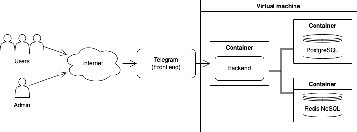
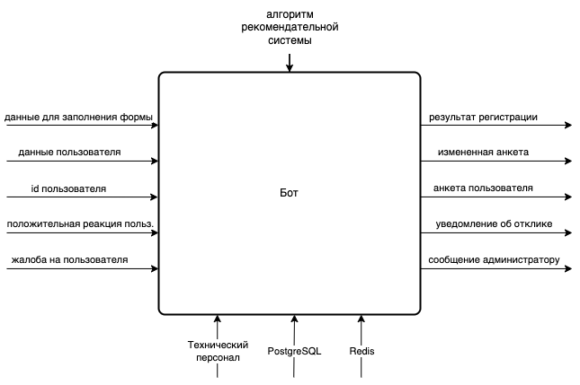
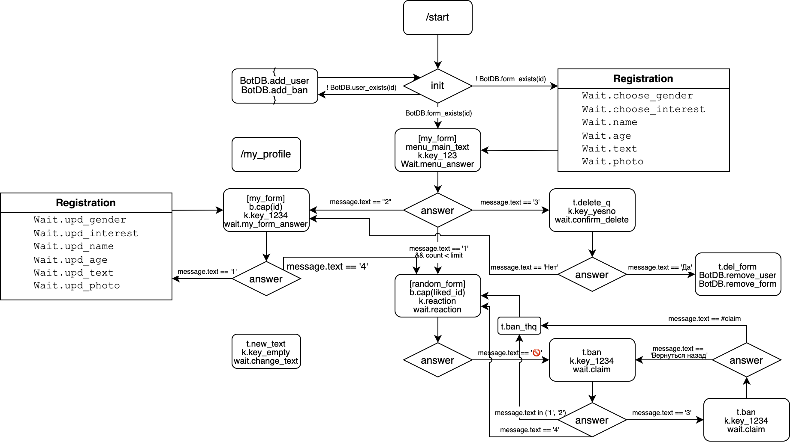
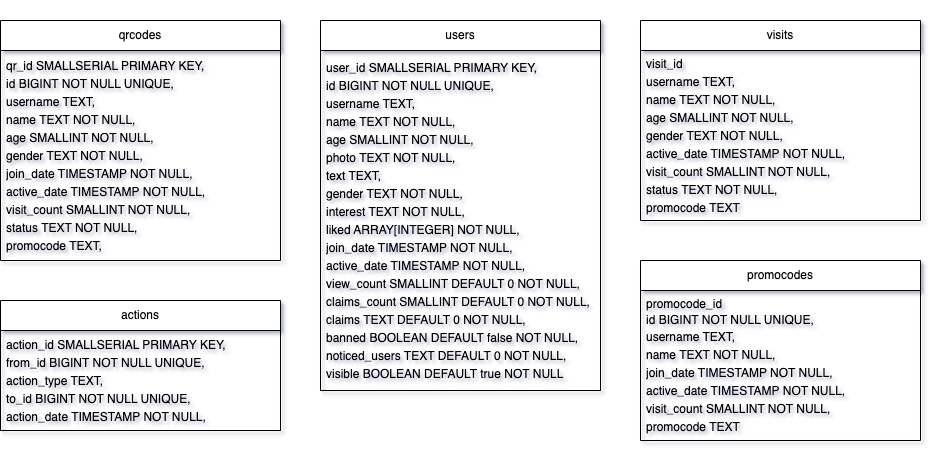

# Telegram_Bot

Асинхронный Telegram Бот AKIRA для знакомств с системой администрирования и поддержки. (асинхронные запросы к бд)

Система состоит из Frontend, Backend, PgSQL и Redis.
- Взаимодействие с бд происходит в [schema.py](db/schema.py) с помощью асинхронной библиотеки `asyncpg`
- Взаимодействие с Telegram через асинхронная библиотека `aiogram`
- Сборка в контейнеры прописана в [docker-compose.yaml](docker-compose.yaml)
- Возможно развернут на VM, [можно тестить](https://t.me/my_buckwheat_bot).
- В качестве NoSQL используется `Redis` для оптимизации SQL запросов.

Структура взаимодейтсивя элементов системы:

В качестве Frontend выступает приложение Telegram, который принимает сообщения в качестве комманд от пользователей. Backend взаимодействует с Frontend по API из асинхронной библиотеки aiogram. В качестве бд выступают PgSQL и Redis (используется для хранения информации о состоянии пользователя и промежуточных данных для оптимизации запросов к PgSQL).

Idef0 диаграмма бота:

Конечный автомат системы:

Схема таблиц в [бд](db/schema.py):

